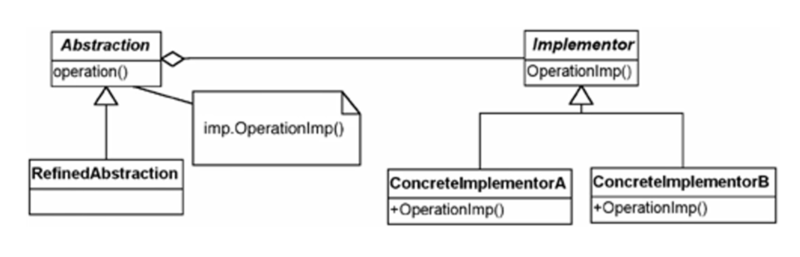

# Bridge Design Pattern

* This is structural design pattern. It decouples an abstraction from its implementation so that the two can vary independently.
* Decouples an abstract class and an implementation class by providing the bridge structure between them
    - Decoupling: to have things behave independently from each other.
    - Abstraction: how things are related to each other conceptually (hiding details)
* This pattern helps to make concrete class functionalities from the interface implementor class.
    - can alter different kind of classes structurally without affecting each other.
    - Abstraction has its own hierarchy, implementation has its own hierarchy.

### When to use bridge pattern?

* When you want to avoid permanent binding between an abstraction and its permanent binding (when implementation must be selected or switched at runtime).
* When both abstractions and implementations can be extensible by sub-classing (lets us combine different abstractions and implementations and extend them independently).
* When changes in the implementation of an abstraction should have no impact on the clients (clients code should not have to be recompiled).
* When you want to hide implementation of an abstraction completely from the clients.
* When you have a ton of implementation classes. A class hierarchy indicates the need to split the objects in two parts.

### Advantages 

* Decouples an implementation so that it does not bound permanently with an interface.
* Abstraction and Implementation can be extended independently.
    - Allows us to vary implementation and abstractions by placing two different class hierarchies.
* Changes to the concrete abstraction classes do not affect the client.
* Adds one more method level redirection to achieve the objective.
* This pattern is extremely helpful when our class and its associated functionalities may change in frequent frequent intervals.

### Disadvantages

* Slightly increases the complexity.

### Compared to adaptor

* The adaptor pattern is geared towards making the unrelated classes work together. Usually applied to the systems they have been designed.
* In-contrast the Bridge cna been used up-front in design.
    - lets abstractions and implementations vary independently.

### Implementing Bridge design pattern

* There are 2 main participants in implementation of the Bridge design patter.
    - Abstraction: An interface or the abstract class.
    - Implementations: An interface or the abstract class.
* An abstraction contains the reference to the implementor.
* Children of the abstraction are referred to as refined-abstractions.
* Children of the implementor are referred to as concrete implementors.
* Since we can changes the reference to implementor in abstractions, we can change the abstractors implementor at runtime.
* The class abstraction and its implementation are loosely coupled.

* Abstraction
    - The core of this design pattern, defines the crux. 
    - Defines abstraction's interface.
    - Contains the reference to the implementor.

* RefinedAbstraction
    - Extends the abstraction and takes the finer details to one level below.
    - Hides the finer elements from the implementors.

* Implementor
    - Defines the interface for implementation classes
        * Implementor provides only primitive operations.
        * Abstractions defines the higher level operations based on this primitives.
    - Provides an implementation in terms of operations provided by the implementor interface.
