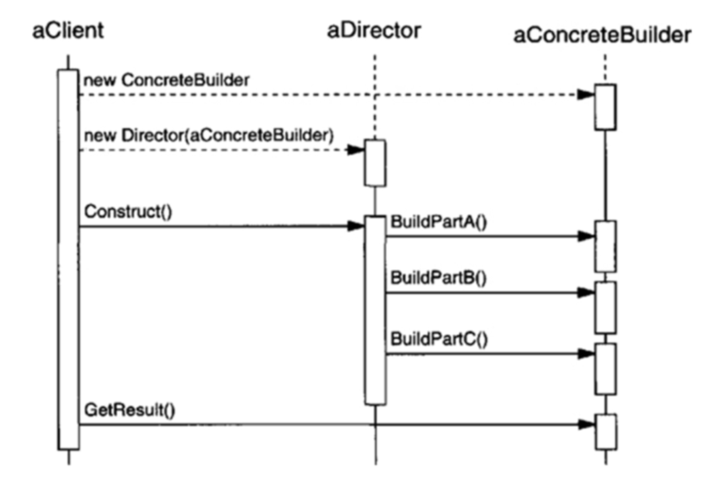

# Builder Design Pattern

* The builder design pattern separates the construction of complex object from its representation.
* Uses same construction processed to create the same object. however, these processes can create different
  representation of objects.
* Uses simple object and step by step to create an object, and the builder class in independent of other object.
* Useful when creating the complex object and is independent of the assembly of the parts of the object.
* In builder pattern the object creation step has isolation, So it does provide the way to create the complex object
  without mixing it with the steps for creating it.

### Why Builder Pattern?

* Builder pattern was introduced to solve the problems with Factory and Abstract Factory design patterns
  * These patterns do not work well when the object to be created contains too many attributes
  * Solves following problems found in Factory pattern
    * Too many arguments are required to pass from the client to tha factory class, it's error prone and hard to maintain the order of arguments.
    * Factory pattern forces us to send all the parameters, optional parameters are required to be sent as NULL.
    * If object is heavy, it's creation is complex. All complexity will be of the factory class and will cause further confusion.
    * [We can use setter to state the objects, but the Object state will be inconsistent unless all the objects are set explicitly] Also this turns to be burden on client, where client is responsible to call all the setters.
* Better approach is to use the Builder patters,
  * It provides a way to build the object step by step.
  * Provides the method that will return the final complex object.

### Advantages of the Builder pattern
* It encapsulates the way the complex object is created.
  * Separates the code of assembling from its representation.
  * Hides the complex construction process and represents it as simple process
* Allows object to be constructed in multi-step and varying process (Opposite of what happen in Factory patters)
* Hides the internal representation of product from the client.
* Focuses on "how the product will be made?"
* Product implementation can be swapped in and out, as client only sees the abstract interface. Thus promote Programming to the Interface. It's easy to change, easy to add new functionality.

### Disadvantages

* Often used to make some composite structures. (composite structures are the object that have the relationships with other objects)
* Requires some amount of code duplication.
* Constructing object requires more domain knowledge of the client than using the factories.
* Factories can be more appropriate when there are less internal representations. don't have other composite structures. don't have many arguments to the constructors.
* DON'T use builder patterns if we want the mutable objects (since object has all complex structure, it wont be good to modify it after the creation process is over).

#### Participants while implementing Builder patter.

###### Builder
* Specifies an abstract interface for creating the Product object.
* Defines the operation for each component that the object client/Director may ask to create.
* Must be general enough to allow the construction of products of all kinds of the concrete builders.

###### Concrete builder
* Constructs and assembles parts of the product by implementing the Builder interface.
* It overrides the operations for components it is interested in creating. (Concrete builder does that actual building)
* Defines and keep tracks of the representation it creates.
  * Builder would return the child nodes to the Director, which would then pass them back to the builder to build the parent nodes.
* Provides an interface for retrieving the product, something like getter.

###### Director
* constructs the object using the builder interface

###### Product
* Represents the complex object under construction. (Product is the end result of the object construction)
* ConcreteBuilder builds the products internal representation and defines the processes by which it is assembled.
* Includes the classes that define the constituent parts, including interfaces for assembling the parts into the final results.

#### Object creation overview
* The client creates the Director object. configures it with the desired builder object.
* The director notifies the builder whenever part of the product should be built.
* The builder handles the request from the director and adds the part to the product.
* The client retrieves the product (final simplified object) from the Builder.

#### Implementation advantages
* Improves modularity.
* Lets you vary the products internal representation.
* It isolates the code for construction and representation.
* Each ConcreteBuilder contains all the code to create and assemble the particular kind of Product.
  * Different directors can reuse it build Product variants from same set of parts.
* Gives us the finer control over the construction process. (step-by-step under Directors control)
  * only when the final product is created, director retrieves it from the Builder.
* The Builder interface reflects the process of constructing the product more than the other creational patterns.