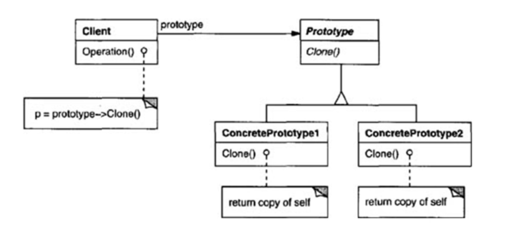

# Prototype design pattern

* This design pattern refers to creating the duplicate object while creating the performance in mind.
    * It specifies the kinds of objects to create using the prototypical instance, and creates the object using this prototype.
* Used when creation of object is costly, required a lot of time and resources and you have similar object already existing.
    * creating a new instance is normally created as expensive operation.
    * main motive behind this pattern is to reduce the expense of this creational process of a new instance.
* This pattern provides us the mechanism to copy the original object to a new object and modify it according to our needs. (usually deep-copy is used according to our need)
* A key aspect is that client code can make new instances without knowing which specific class is being instantiated.
* Mandates that object which is being copied should provide copying feature.
* Whether to perform shallow copy or deep copy depends on the requirements and design.

### Primary usage example

* Object that loads from database
    * we might need to modify this object in our program multiple times. It is not good idea to create the Object using new keyword and load all the data again from database.
    * we can cache the object, return the clone of object on the next request. We can update the database when needed and would reduce the number of database calls.

### When to use Prototype design pattern?

* When a system is independent of how its products are created, composed and represented. System does not create creational mechanism of its products.
* Can use this pattern when we need to instantiate classes at runtime. E.g. Dynamic loading.
* Whena system must create new objects of many types in a complex class hierarchies. (You want to build the class hierarhies of fatories that parallel the class hierarchies of products)
* When instance of class have one of only few different combinations of states. Its much more convinient to install corresponding number of prototypes and clone them rather than instantiate the class manually.

### Advantages 

* Hides tha complexities of making the new instances from the client.
* Provides the options for client to generate objects whose type is not known.
* In many circumstances copying the object will be more efficient that creating a new object.
* This design pattern is more flexible than other design patterns because clients can include or discard products at runtime. And create the new instances at cheaper cost.
* Lets client define new behavior through the object composition. By specifying the values of object's variables and not defining new classes.
* A client can exhibit new behavior by delegating the responsibility to the prototype. Cna greatly reduce the number of classes a system needs. Also reduces sub-classing.

### Drawbacks

* Each subclass has to implement a cloning mechanism
* Implementing cloning mechanism can be challenging.
    * If objects under consideration do not support copying.
    * There is circular reference in Object(s).
* Language inbuilt cloneable interfaces might have some problems

### Implementing Prototype design pattern

Following participants are present includes while implementing prototype design pattern

* Prototype
    * declares an interface for cloning itself.
* ConcretePrototype
    * implements and operation for cloning itself.
* Client
    * creates a new object by asking the prototype to clone itself.

### Problems with cloneable interfaces

* Cloneable interfaces in many languages do not provide the deep copy feature, hence we might need to shallow copy the object recursively to compose the entire object.
* In Java language, Cloneable is the marker interface, its does not contain any method. But still need to implement it to tell JVM that class in cloneable.
* You cannot do the polymorphic clone operation. (We cannot cast something as cloneable)
* The clone generally shares the state with the clones copy, hence if that state is immutable, we don't actually have two independent object.

#### Better alternatives to Cloneable 

* Copy constructor in C++
    * copy-constructor is the regular constructor which returns the new instance of the class.
    * object is passed as parameter to this constructor and custom logic for cloning that object is implemented.
    * Copy constructor does not require to cast and allows us to modify the final fields.
    * Copy constructor does not force us to implement any interface or throw any exception.
    * Copy constructor does not require us to depend on unknown object creation mechanism, and does not require parent class to follow any contract and implement anything.
    * Client has total control object the object creation, it can specify the custom cloning implementation.

* Serialization / Deserialization
    * instead of cloning we can serialize the object and then immediately deserialize the object, it would lead to new instance creation.
    * There are amy drawbacks as we do not have control over the object creation, any modification. Also serialization is slower than cloning.
    * Major advantage is that serialization does deep cloning and is much simpler than cloning.